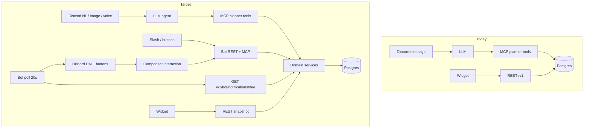

# Useful Discord Bot Design

**Date:** 2026-08-18  
**Status:** Draft for review  
**Scope:** Make `bot/` a complete personal planner companion: MCP/REST parity, Discord-native actions, proactive DMs, capture, and lightweight planning intelligence. Widget stays the glance surface. Bot becomes capture + conversation + pager.  
**Audience:** Allowlisted Discord users only (unchanged). Not a public product.

This spec covers all five clusters from the 2026-08-18 idea pass as **one product**, shipped in five phases so later work does not redesign earlier work. Phases are delivery slices, not separate products.

| Phase | Cluster | Ships |
|---|---|---|
| A | Planner holes | MCP/REST verbs the chat already pretends to have |
| B | Discord-native | Slash shortcuts, embeds, buttons, guild gating, durable history |
| C | Proactive companion | Alert DMs, opt-in briefings, overdue, optional presence |
| D | Capture | Images, “inbox this”, optional voice → same create path |
| E | Intelligence | Overlap warnings, free-slot suggest, series streaks, notes checklists |

Phase A is the foundation. B’s buttons are the interaction model C reuses. D only creates tasks through A’s idempotent create. E reads the same day-range materialization A exposes.

---

## 1. Goal

A user should be able to:

1. Capture work in Discord (NL, slash, image, reply-to-message, voice) into the same Postgres planner the widget reads.
2. Act on work from Discord without an LLM round-trip (complete / snooze / skip / undo).
3. Get pinged **only when they asked** (timed alerts) or **opted in** (morning/evening briefing).
4. Trust the bot: it never claims a mutation it did not perform; it never silently completes or rolls days; it never DMs a token or reminder into a guild channel.

Success is behavioral, not “more tools.”

---

## 2. Non-goals (this spec)

- Public Discord bot, teams, shared lists, roles other than allowlist.
- Replacing or redesigning the Android widget UI (widget only consumes new snapshot fields).
- First-class subtask table, Focus timer, Live Activity, `.ics` calendar import/export.
- Giving the bot its own Postgres connection.
- Per-user Discord presence when more than one snowflake is allowlisted (Discord presence is process-global).
- Changing incomplete-overnight rules (`day` stays put; open backlog is a query).

Follow-ups after this spec, not designed here: first-class subtasks (migrate `- [ ]` notes), calendar sync, multi-device push besides Discord + widget.

---

## 3. Decisions locked

| Topic | Choice |
|---|---|
| Identity | Discord snowflake; `BOT_API_SECRET` proves the bot; `X-Discord-Id` selects the user |
| Source of truth | Postgres via existing domain services. MCP and new bot REST are adapters |
| Discord delivery | Bot process owns Gateway + DMs + components. Backend never calls Discord |
| Due computation | Backend `NotificationService`. Bot polls, sends, acks |
| Briefings | **Opt-in.** Default off. Alerts fire only when an alert row exists |
| Default alert on create | **None.** “add gym at 7” is calendar-only. “remind me…” or “ping me” writes alerts |
| Reminder channel | DM only. Never guild. If DMs closed: mark delivery failed, do not print in-channel |
| Quiet hours | Defer alerts to `quiet_hours_end`. Do not drop them |
| Missed alerts after outage | Catch-up window **5 minutes**. Older unsent alerts marked `skipped:missed`, not blasted |
| Missed briefings | Catch-up window **2 hours** if still the same logical day |
| Overdue ping | Folded into evening briefing. Separate overdue DM only if evening briefing is off |
| Guild NL default | Keep today’s `all` messages (personal bot). `/settings guild_mode` can lock to `mention` or `channel` |
| DMs | Always planner input for allowlisted users |
| Slash / buttons | Always allowed for allowlisted users; do not require mention |
| History | Persist under a bot Docker volume (JSON). Not Postgres. Midnight logical-day reset unchanged |
| Capture drafts | In-memory TTL 10 minutes (bot restart drops unconfirmed drafts) |
| Idempotent Discord creates | Bot injects `client_request_id = discord:msg:{message_id}` (slash: `discord:ix:{interaction_id}`) on create tool calls |
| Undo | Soft-delete already exists. Restore allowed **5 minutes**. No hard-purge job in this spec |
| Occurrence “move this Thursday” | `series_exceptions.kind=override` **upsert** (today’s add_exception no-ops on duplicate — that is a bug to fix) |
| Series reminders | Alerts hang off **series** as well as tasks, copied onto materialized occurrences |
| Overlap | Warn, do not block create |
| Suggest slots | Search 07:00–21:00 local, incomplete timed blocks only, duration default 30 |
| Checklists | Markdown in `notes` (`- [ ]` / `- [x]`). No new table |
| Tool count | Workflow tools, not 1:1 REST. ~18 is acceptable; descriptions must say when **not** to use |
| LLM | Existing OpenAI-compatible client. Vision/transcribe are optional extra models/URLs |
| Widget | Keep REST `/v1/widget/snapshot`. Include series alerts on occurrence items |
| Auth for new bot routes | Same as `/v1/bot/link`: `X-Bot-Secret` + allowlisted Discord id where the route is per-user |

---

## 4. Current vs target

Today: every allowlisted guild/DM message → LLM → MCP tools (`planner_*`). Slash is help/link/timezone(read-only)/status/clear. `alerts` rows can be stored on REST create but MCP cannot set them, and **nothing fires**. `/v1/me` can PATCH timezone but the bot cannot. Uncomplete exists on REST only. History is an in-memory `Map`.



Hard rule: **domain services remain the only place business rules live.** FastMCP wrappers and `/v1/bot/*` stay thin.

---

## 5. Architecture

### 5.1 Processes

Unchanged compose topology: `postgres` + `api` + `proxy` + `bot`.

| Process | New responsibility |
|---|---|
| `api` | Settings columns, series alerts, notification claim/ack, restore, uncomplete-occurrence, occurrence upsert, range already exists, overlap/suggest/streaks helpers, MCP tool expansions, `/v1/bot/notifications/*`, `/v1/bot/settings` |
| `bot` | Embeds + components, slash shortcuts, guild gating, history file, notification worker, capture pipeline, optional presence ticker |
| `widget` | Render occurrence `alerts` if present (optional; ignore unknown fields today is already JSON-tolerant) |

### 5.2 Why backend computes “due”

Fire times depend on user TZ, `day_starts_at`, quiet hours, series materialization, and skip/override/complete. The bot must not reimplement that. The bot is a dumb sender:

1. `GET /v1/bot/notifications/due` → claimed rows + render payload  
2. Send DM  
3. `POST .../ack` with `discord_message_id` or `POST .../fail` with reason  

### 5.3 Why bot does not get a database

Notifications, settings, and tasks are planner data → Postgres. Conversation transcripts are an LLM UX cache → JSON volume `bot_data:/app/data/history.json`. Capture drafts are ephemeral → memory.

### 5.4 File map (implementation later)

**Backend**

- [backend/src/structured_backend/models/user.py](backend/src/structured_backend/models/user.py) — settings columns  
- [backend/src/structured_backend/models/alert.py](backend/src/structured_backend/models/alert.py) — optional `series_id`  
- new `models/notification.py` — `NotificationDelivery`  
- [backend/src/structured_backend/services/tasks.py](backend/src/structured_backend/services/tasks.py) — restore, alert replace, uncomplete already exists  
- [backend/src/structured_backend/services/series.py](backend/src/structured_backend/services/series.py) — uncomplete occurrence, **upsert** exception, series alerts  
- new `services/notifications.py` — fire_at, quiet hours, claim  
- new `services/schedule.py` — overlap + free slots + streaks  
- [backend/src/structured_backend/mcp_server/tools.py](backend/src/structured_backend/mcp_server/tools.py) + [server.py](backend/src/structured_backend/mcp_server/server.py)  
- new `api/bot_notifications.py`, `api/bot_settings.py`  
- Alembic `0003_bot_companion.py`

**Bot**

- [bot/src/bot.ts](bot/src/bot.ts) — gating, slash, component router  
- new `embeds.ts`, `components.ts`, `notifyWorker.ts`, `capture.ts`, `historyFile.ts`  
- [bot/src/agent.ts](bot/src/agent.ts) — prompt + vision path  
- [bot/src/store.ts](bot/src/store.ts) — load/save through `historyFile.ts`  
- [bot/src/config.ts](bot/src/config.ts) — poll interval, vision/transcribe, data dir  
- [bot/src/index.ts](bot/src/index.ts) — start worker after login  

---

## 6. Data model

### 6.1 `users` additions

Keep one row per Discord user. Add nullable settings; defaults mean “feature off” or “current behavior.”

| Column | Type | Default | Meaning |
|---|---|---|---|
| `briefing_morning_time` | `TIME` | `NULL` | Local clock; `NULL` = off |
| `briefing_evening_time` | `TIME` | `NULL` | Local clock; `NULL` = off |
| `quiet_hours_start` | `TIME` | `NULL` | Inclusive. Both start+end required to enable |
| `quiet_hours_end` | `TIME` | `NULL` | Exclusive end. Supports wrap (22:00–07:00) |
| `reminders_enabled` | `BOOLEAN` | `TRUE` | Master switch for alert DMs (not briefings) |
| `overdue_enabled` | `BOOLEAN` | `FALSE` | Only consulted when evening briefing is off |
| `guild_mode` | `TEXT` | `'all'` | `all` \| `mention` \| `channel` |
| `planner_channel_id` | `TEXT` | `NULL` | Required when `guild_mode=channel` |
| `capture_images` | `BOOLEAN` | `TRUE` | Ignore image attachments if false |
| `capture_voice` | `BOOLEAN` | `TRUE` | Ignore voice clips if false |
| `presence_enabled` | `BOOLEAN` | `FALSE` | Honored only if allowlist length is 1 |

Existing: `timezone`, `day_starts_at` (already used by [timeutil.user_today](backend/src/structured_backend/timeutil.py)).

Validation:

- IANA timezone via existing `validate_timezone`
- `guild_mode=channel` without `planner_channel_id` → `validation_error`
- quiet hours: both null or both set
- briefing times independent

### 6.2 `alerts` expansion

Today: `task_id` NOT NULL, `kind` default `start`, `offset_minutes` nullable.

Change:

- `task_id` nullable  
- `series_id` nullable FK `series.id` ON DELETE CASCADE  
- CHECK: exactly one of `(task_id, series_id)` is non-null  
- `kind` stays `start` (fire at `start_datetime + offset_minutes`)  
- `offset_minutes`: negative = before start (`-10` = 10 minutes before). `NULL` = 0  

Do **not** introduce a second “absolute remind_at” column. Absolute “in 20 minutes” is a timed task with `day=today`, `start_time=now+20`, `alerts=[{kind:start, offset_minutes:0}]`.

Widget already understands `alerts: [{kind, offset_minutes}]` on timeline items ([StructuredTask.kt](widget/app/src/main/java/com/example/structuredwidget/data/StructuredTask.kt)). Copy series alerts onto occurrence items in snapshot + day merge.

### 6.3 `notification_deliveries`

| Column | Type | Notes |
|---|---|---|
| `id` | UUID PK | |
| `user_id` | UUID FK users | |
| `kind` | TEXT | `alert` \| `briefing_morning` \| `briefing_evening` \| `overdue` |
| `source_key` | TEXT | Unique **per user** (see 7.3) |
| `fire_at` | TIMESTAMPTZ | UTC instant to send |
| `claimed_at` | TIMESTAMPTZ | Lease; null = unclaimed |
| `delivered_at` | TIMESTAMPTZ | |
| `discord_message_id` | TEXT | |
| `status` | TEXT | `pending` \| `claimed` \| `delivered` \| `failed` \| `skipped` |
| `skip_reason` | TEXT | `missed` \| `dms_closed` \| `reminders_disabled` \| `quiet_deferred` (debug) |
| `payload` | JSONB | Render snapshot: title, body, task_id, occurrence_id, buttons, color |
| `created_at` | TIMESTAMPTZ | |

Indexes:

- unique `(user_id, source_key)`  
- `(status, fire_at)` where `status IN ('pending','claimed')`  
- `user_id`

### 6.4 No conversation table

`bot/data/history.json` shape:

```json
{
  "version": 1,
  "conversations": {
    "<discordUserId>:<channelId>": {
      "logical_date": "2026-08-18",
      "messages": [ { "role": "user|assistant", "content": "..." } ]
    }
  }
}
```

Tool-call internals stay out of the file (same as today’s `push` which only stores the final user+assistant pair in [agent.ts](bot/src/agent.ts)). Write atomically (`*.tmp` + rename). Load on boot. Trim still uses `MAX_HISTORY_CHARS`.

### 6.5 Soft delete / restore

`tasks.deleted_at` / `series.deleted_at` already exist. Add:

- `TaskService.get_deleted(user, id)` ignoring the live filter  
- `TaskService.restore(user, id)` if `deleted_at` is set and `utcnow() - deleted_at <= 5 minutes`  
- Same for series  

After 5 minutes: tool returns `undo_expired` with hint “create it again”. Rows remain in DB (no purge job).

---

## 7. Time, alerts, notifications

All clock reads in services go through `timeutil.utcnow()` so tests can freeze time (existing pattern in [docs/superpowers/plans/2026-07-23-structured-backend.md](docs/superpowers/plans/2026-07-23-structured-backend.md)).

### 7.1 `start_datetime`

For a timed item with `day` + `start_time` in `user.timezone`:

```
local = datetime.combine(day, start_time, tzinfo=ZoneInfo(user.timezone))
start_utc = local.astimezone(UTC)
fire_at = start_utc + timedelta(minutes=offset or 0)
```

All-day / no start_time: fire at **09:00 local** on `day`, then apply offset. If `day_starts_at` is after 09:00, use `day_starts_at` instead so the ping still falls on that logical day.

Inbox (`day is NULL`): **cannot fire**. Agent must schedule a timed task.

Completed items (`completed_at` set, or occurrence completion row): do not enqueue. If a pending delivery exists, mark `skipped` with `completed`.

Skipped occurrences: do not enqueue.

### 7.2 Quiet hours

`in_quiet_hours(local_time)`:

- If either bound null → false  
- If `start < end` → `start <= t < end`  
- If `start > end` (overnight) → `t >= start OR t < end`  
- If `start == end` → treat as disabled (invalid; PATCH rejects)

When an alert would fire inside quiet hours, **do not send**. Set `fire_at` to the next `quiet_hours_end` in user TZ (as UTC) and keep `status=pending`. Do this at enqueue time and again at claim time (DST / settings change).

Briefings that land in quiet hours: same deferral, but if deferral crosses out of the logical day, skip `skipped:missed` (don’t send yesterday’s “good morning” at 07:00 the next day).

### 7.3 `source_key`

| Kind | Key |
|---|---|
| Task alert | `alert:task:{task_id}:{fire_at:%Y-%m-%dT%H:%M}` |
| Occurrence alert | `alert:occ:{series_id}:{YYYY-MM-DD}:{fire_at:%Y-%m-%dT%H:%M}` |
| Morning | `briefing:morning:{logical_today}` |
| Evening | `briefing:evening:{logical_today}` |
| Overdue | `overdue:{logical_today}` |

Minute granularity so snooze (new start → new fire_at) is a new key. Unique constraint makes retries idempotent.

### 7.4 Enqueue algorithm (called from due-endpoint, not a second cron)

Lookahead: `now-5min … now+15min` for alerts; briefings use logical today + configured local time converted to UTC.

For each allowlisted user with a user row:

1. If `reminders_enabled` and any incomplete timed/all-day tasks on yesterday/today/tomorrow with alerts: compute `fire_at`, insert pending if key missing.  
2. Materialize series for yesterday…tomorrow; for each incomplete non-skipped occurrence, apply **series** alerts the same way.  
3. If `briefing_morning_time` set: `fire_at = combine(logical_today, morning_time, tz)` (if that instant already passed by >2h → skip insert; if passed by ≤2h and no row → insert pending immediately).  
4. Same for evening.  
5. If evening briefing is null and `overdue_enabled` and `open_backlog_count > 0`: enqueue overdue at 18:00 local (or immediately if within 2h catch-up).

Do not precompute a year of series alerts. Only ±1 day around `user_today`.

### 7.5 Claim / lease

`GET /v1/bot/notifications/due?limit=50`:

```
UPDATE notification_deliveries
SET status='claimed', claimed_at=now()
WHERE id IN (
  SELECT id FROM notification_deliveries
  WHERE (
      (status='pending' AND fire_at <= now())
      OR (
        status='claimed'
        AND claimed_at < now() - interval '60 seconds'
        AND delivered_at IS NULL
      )
    )
  ORDER BY fire_at
  LIMIT :limit
  FOR UPDATE SKIP LOCKED
)
RETURNING ...
```

Re-claim stale `claimed` so a crashed bot retries after 60s.

Per-user send cap: the worker sends at most **5 DMs per `discord_id` per tick**. Unsent claimed rows are returned to `pending` with `claimed_at=NULL` in the same tick (`POST /v1/bot/notifications/{id}/fail` reason `rate_cap` must **not** be used for this — use `POST /v1/bot/notifications/{id}/unclaim`). That avoids starving other users and avoids a 60s delay from the lease.

If `now - fire_at > 5 minutes` for `kind=alert` at claim time: set `skipped:missed` instead of returning it (except the 5 min catch-up: `fire_at` in the last 5 min is valid). Briefings: 2h.

Payload must be self-contained so the bot does not fetch MCP to render:

```json
{
  "delivery_id": "...",
  "discord_id": "123",
  "kind": "alert",
  "embed": {
    "title": "Gym",
    "description": "starts in 10m",
    "color": "#5E96CB",
    "fields": [
      { "name": "When", "value": "Thu 7:00–7:30" },
      { "name": "Notes", "value": "…" }
    ]
  },
  "buttons": ["complete", "snooze_1h", "tomorrow", "skip"]
}
```

`skip` only if `occurrence_id` present. `tomorrow` only for one-off tasks (not series — use skip or override).

### 7.6 Ack / fail

- **ack:** `status=delivered`, `delivered_at=now()`, store message id  
- **fail `dms_closed`:** `status=failed`; do **not** auto-retry (user must open DMs). Next alert is a new key.  
- **fail `discord_4xx`:** retry via lease expiry unless 403/400 on DM (then dms_closed)  
- Sending in a guild is forbidden in code, not just policy

### 7.7 Snooze (button and NL)

| Item | Snooze 1h | Tomorrow |
|---|---|---|
| Timed one-off | `start_time += 1h`; if ≥ 24:00, `day += 1` and time wrap | `day += 1`, keep time |
| All-day one-off | Convert to timed: `day=today`, `start_time=now+1h` local, `is_all_day=false` | `day += 1` stay all-day |
| Occurrence | `override` start_time to now+1h (or original+1h) **that day only** | `skip` today + `planner_create_task` clone on tomorrow (one-off). Do **not** shift the series rule |
| Inbox | Become timed today now+1h | Become all-day tomorrow |

After snooze: delete **pending/claimed** deliveries for that source prefix (`alert:task:{id}:` / `alert:occ:{sid}:{day}:`) so the next enqueue emits a new key. Do not delete `delivered` rows.

NL “snooze gym 1h” uses the same service function `snooze_item(id, minutes|until_day)` so buttons and MCP share it. Expose as `planner_reschedule` extensions:

- `snooze_minutes: int`  
- `tomorrow: bool`  

Keep existing `task_id+day` and `move_open_before_to_today`.

### 7.8 NL → alert mapping (agent rules)

| User says | Persist |
|---|---|
| add/schedule X at 3pm | Timed task, **no** alert |
| remind me to X at 3pm / ping me / alert me | Timed + `alerts:[{offset_minutes:0}]` |
| remind me 10 min before | Timed (need a start) + `offset_minutes:-10` |
| remind me in 20 min | Timed today `now+20`, offset 0 |
| remind me to X (no time) | Inbox, **no** alert, **do not ask**. A ping requires a time (“in 20 min”, “at 3pm”) |
| don’t forget X tomorrow | All-day tomorrow + 09:00 alert (`offset` from all-day rule) |
| every weekday at 7, remind me | Series + series alert offset 0 |

Never tell the user a reminder is set unless the tool result includes `alerts` with length > 0.

---

## 8. MCP contract

Prefix remains `planner_`. `response_format`: `concise` (default) | `detailed`. Timezone is still **not** a tool argument; server uses profile.

Errors stay `{error:true, code, message, hint?}` in the tool body (current FastMCP pattern). Add `isError: true` on the MCP result when `error` is set so the model treats it as failure (today some failures look like normal JSON).

### 8.1 Extended existing tools

**`planner_get_overview`**

Add:

- `open_backlog_preview` (already `open_preview`)  
- `overlaps_today`: list of `{a, b, minutes}` concise, max 5  
- `streaks`: `{series_id, title, done, expected, window:"week"}` max 10  
- `settings`: `{timezone, day_starts_at, briefing_morning_time, briefing_evening_time, quiet_hours, guild_mode, reminders_enabled}` so the agent does not need a second call for “is briefing on?”

**`planner_find_tasks`**

Add optional `day_from` + `day_to` (`YYYY-MM-DD`). Same span cap as REST `max_range_days` (366, but **agent description must say prefer ≤ 7 days**). Merges one-off + occurrences like [list_tasks](backend/src/structured_backend/api/tasks.py). Mutually exclusive with `inbox` / `open_backlog`. `q` may combine with a range (filter titles).

**`planner_create_task` / `planner_update_task`**

Pass through: `color`, `symbol`, `duration_minutes`, `alerts` (replace-all on update; omit = leave unchanged; `alerts: []` = clear), `client_request_id`.

Allowed `symbol` values (widget map in [WidgetIconLibrary.kt](widget/app/src/main/java/com/example/structuredwidget/widget/common/WidgetIconLibrary.kt)):

`alarm.fill`, `clock`, `moon.fill`, `sun.max.fill`, `dumbbell.fill`, `car.fill`, `bicycle`, `pencil`, `calendar`, `house.fill`, `checkmark`, `exclamationmark.triangle`

Unknown symbol stored anyway (widget falls back to default). Agent should pick from the list.

`color`: `#RRGGBB`. Agent palette: `#5E96CB` (default), `#26DE81`, `#F7B731`, `#EB3B5A`, `#A55EEA`, `#FD9644`, `#778CA3`.

**`planner_create_series` / `planner_update_series`**

Same `color`, `symbol`, `alerts` (series-level).

**`planner_reschedule`**

Add `snooze_minutes`, `tomorrow` as in 7.7. Occurrence ids allowed for snooze/tomorrow/override path; still rejected for raw “move series instance with only day” without override (keep current error text, plus hint to use `planner_override_occurrence` or `tomorrow`).

**`planner_complete_tasks` / `planner_delete_tasks`**

Unchanged semantics. Delete still refuses `occ_*` (skip or delete series).

### 8.2 New tools

**`planner_uncomplete_tasks`**

`task_ids: string[]` — UUID or `occ_*`. Occurrence: delete `series_completions` row. Idempotent if already incomplete.

**`planner_restore_tasks`**

`task_ids` and/or `series_ids`. 5 minute window. Returns restored objects or `undo_expired`.

**`planner_override_occurrence`**

```
occurrence_id? | (series_id + day)
title?, start_time?, duration_minutes?, is_all_day?
```

Writes `kind=override`. **Upsert** on `(series_id, occurrence_day, kind)`. This fixes [add_exception](backend/src/structured_backend/services/series.py) which returns early if a row exists and **ignores new fields**.

**`planner_update_settings`**

Any subset of section 6.1 plus `timezone`, `day_starts_at`. Empty PATCH is no-op. Returns full settings.

**`planner_suggest_slots`**

```
duration_minutes: int = 30
day?: YYYY-MM-DD   # default user_today
after_time?: HH:MM # default now if day is today else 07:00
count: int = 5
```

Returns `{slots:[{day, start_time, end_time}]}`. Free gaps in 07:00–21:00 local minus incomplete timed intervals (use `duration_minutes` or 30). All-day does not occupy a clock gap. Empty list is valid (“no free slot”).

No `planner_get_settings` — overview.detailed / update_settings return value is enough.

**`planner_toggle_note_item`** (Phase E, but the name is reserved now)

```
task_id: str
item_text: str
checked: bool
```

Finds the first `notes` line matching `- [ ] …` or `- [x] …` whose text contains `item_text` (case-insensitive). Sets that box to `checked`. If no matching line:

- `checked=true` → append `- [x] {item_text}`
- `checked=false` → `validation_error` (nothing to uncheck)

Returns `{task_id, notes}`. One-off tasks only (`occ_*` rejected: occurrence notes are series notes — hint to update the series or add a one-off).

### 8.3 Agent system prompt additions

Keep timezone-fixed rules. Add:

- Find before mutate; never invent ids (unchanged)  
- Remind vs add (section 7.8)  
- Recurring still `planner_create_series`  
- Uncheck → uncomplete; “undo delete” → restore, not recreate, if within 5 min  
- “just this Thursday” → override, not update_series  
- Week views → `day_from`/`day_to`, not 7× `day=`  
- After create, confirm from tool JSON (title, day, time, alerts)  
- Checklists live in notes; toggling is `planner_toggle_note_item` (Phase E). Until that tool exists, do not invent checklist completions  
- Do not mention MCP, sessions, or API keys  
- Discord markdown only (unchanged). Embeds/buttons are **bot-rendered from tool results**, not invented by the model. The model returns short text; the bot may attach components when the last mutation includes a `task_id` / `occurrence_id`

**Last-mutation components:** If the final assistant text follows a successful create/complete/reschedule in this turn, `bot.ts` parses the last tool JSON (not the prose) and adds a button row. If parsing fails, text-only (no fake buttons).

### 8.4 `client_request_id`

Bot sets on every create originating from a Discord message/interaction:

- Message: `discord:msg:{message.id}`  
- Slash `/add`: `discord:ix:{interaction.id}`  
- Image batch: `discord:msg:{id}:i{n}` per extracted task  
- Bookmark: `discord:msg:{source_message.id}:inbox`  

Retries after LLM timeout do not duplicate. 409 with different payload: agent should not retry the same id; tell the user it already captured that message.

The **bot injects** `client_request_id` in `agent.ts` on `planner_create_task` / `planner_create_series` if the model omitted it. The model is not trusted to mint ids. Image/bookmark paths set the id in code, not via the LLM.

---

## 9. Bot REST

Widget routes stay `X-Discord-Id` + `X-Widget-Token`. Bot routes stay `X-Bot-Secret`. Reuse `_require_bot` from [bot_link.py](backend/src/structured_backend/api/bot_link.py).

| Method | Path | Auth | Purpose |
|---|---|---|---|
| GET | `/v1/bot/notifications/due` | secret | Claim + return payloads (all users) |
| POST | `/v1/bot/notifications/{id}/ack` | secret | Body: `{discord_message_id}` |
| POST | `/v1/bot/notifications/{id}/fail` | secret | Body: `{reason}` (`dms_closed`, `discord_4xx`, …) |
| POST | `/v1/bot/notifications/{id}/unclaim` | secret | Return to `pending` (per-user send cap) |
| GET | `/v1/bot/settings` | secret + `X-Discord-Id` | |
| PATCH | `/v1/bot/settings` | secret + `X-Discord-Id` | Same body as MCP update_settings |
| POST | `/v1/bot/actions/complete` | secret + `X-Discord-Id` | `{id}` task or occ |
| POST | `/v1/bot/actions/uncomplete` | secret + `X-Discord-Id` | |
| POST | `/v1/bot/actions/snooze` | secret + `X-Discord-Id` | `{id, minutes}` or `{id, tomorrow:true}` |
| POST | `/v1/bot/actions/skip` | secret + `X-Discord-Id` | `{occurrence_id}` |
| POST | `/v1/bot/actions/restore` | secret + `X-Discord-Id` | `{task_id}` or `{series_id}` |
| GET | `/v1/bot/views/today` | secret + `X-Discord-Id` | Timeline for slash `/today` (no LLM) |
| GET | `/v1/bot/views/inbox` | | |
| GET | `/v1/bot/views/open` | | |
| GET | `/v1/bot/views/week` | | `user_today` through +6 days |

Slash shortcuts **must not** call the LLM. They use `/v1/bot/views/*` + embeds.

MCP remains the agent path. Buttons use `/v1/bot/actions/*` (faster, no MCP session). Both call the same services.

Also expose timezone PATCH on `/v1/bot/settings` so `/timezone Asia/Kolkata` works without widget token. Widget `/v1/me` remains token-auth for the app.

---

## 10. Discord UX

### 10.1 Intents

Keep Guilds, GuildMessages, MessageContent, DirectMessages, Partials.Channel. Add **no** privileged intents beyond Message Content (already required).

Register:

- Existing chat commands  
- New slash commands  
- Message context menu **Inbox this** (`ContextMenuCommandBuilder`, type Message)

### 10.2 Guild gating

```
function shouldHandleMessage(message, settings):
  if message.author.bot: false
  if not allowlisted: unauthorized reply (unchanged)
  if message.channel.isDMBased(): true
  if settings.guild_mode == "all": true
  if settings.guild_mode == "mention":
    return bot_mentioned(message) or message.reference.resolved.author.id == bot.user.id
  if settings.guild_mode == "channel":
    return message.channelId == settings.planner_channel_id or bot_mentioned(message)
```

Slash, context menu, and buttons: allowlist only (ignore guild_mode).

When ignored (mention-mode and no mention): **stay silent** (do not “Unauthorized” — that is for non-allowlisted users).

### 10.3 Slash commands

| Command | LLM? | Behavior |
|---|---|---|
| `/help` | no | Updated examples: remind vs add, buttons, `/today` |
| `/link` `/relink` | no | Unchanged two-phase DM |
| `/timezone [zone]` | no | Get, or PATCH settings if `zone` provided |
| `/status` | no | Add worker: last poll ok/age, pending claim count optional |
| `/clear` | no | Clear file-backed history for this user+channel |
| `/today` | no | Embed of today: timed, all-day, counts for inbox/open |
| `/inbox` | no | List inbox titles + “schedule” hint |
| `/open` | no | Open backlog |
| `/week` | no | 7-day compact list (cap 25 fields/embed; extra as follow-up messages) |
| `/add title: when?: duration?: remind?:` | no | Structured create. `when` accepts `YYYY-MM-DD`, `today`, `tomorrow`, `HH:MM`, `YYYY-MM-DD HH:MM` only — **no** free NL. `remind` boolean default false (offset 0 if when has a time) |
| `/settings` | no | Subcommands: `get`; `briefing morning|evening|off time:`; `quiet start: end:`; `guild all|mention|channel channel?:`; `reminders on|off` |

NL remains the way to say “add lunch after my 2pm meeting.”

`/add` with missing `when` → inbox.

### 10.4 Embeds

Shared `embeds.ts`:

- Title: task title (`~~title~~` after complete)  
- Color: parse `#RRGGBB` or default `0x5E96CB` (widget [DEFAULT_ACCENT](widget/app/src/main/java/com/example/structuredwidget/widget/common/WidgetTheme.kt))  
- Description: at most 200 chars of notes  
- Fields: When, Duration, Recurring (yes/no)  
- Footer: `inbox` \| `all-day` \| `timed` + logical date  
- allowedMentions: `{ parse: [] }` everywhere (already in `replySafe`)

List views: one embed, bullet lines `` `{HH:mm}` **title** ``, completed prefixed with `✓`. Discord 4096 description limit; truncate with “and N more — ask in chat.”

### 10.5 Buttons

`custom_id` max 100. Versioned prefix `s1:` (structured v1).

| custom_id | Action |
|---|---|
| `s1:c:{id}` | complete |
| `s1:u:{id}` | uncomplete (shown after complete, 5 min) |
| `s1:z:{id}` | snooze 1h |
| `s1:t:{id}` | move/skip-clone tomorrow |
| `s1:k:{id}` | skip occurrence (`id` is `occ_…`) |
| `s1:r:{id}` | restore (on delete confirmation) |
| `s1:ml` | move open backlog to today (briefing only, no id) |
| `s1:ok:{draftId}` | confirm capture draft |
| `s1:x:{draftId}` | cancel draft |

`{id}` is task UUID or `occ_{uuid}_{YYYY-MM-DD}` (length ~58 → total well under 100).

On click:

1. Allowlist + `interaction.user.id` must own the item (404/403 → ephemeral “Not your task.”)  
2. Call `/v1/bot/actions/…`  
3. `interaction.update` the original message (disable buttons, strike title)  
4. Ephemeral follow-up only on error  

Component collector is **not** used; global `interactionCreate` routes `isButton()`.

### 10.6 Delete confirmation

NL “delete X”: agent calls delete, bot attaches **Undo** (`s1:r:{id}`) for 5 minutes. After restore window, button edits to “Undo expired.”

### 10.7 Presence

If `AUTHORIZED_USER_IDS` has exactly one id **and** that user’s `presence_enabled`: every 60s set `Client.user.setActivity({ name: "7:00 Gym", type: Watching })` from overview `next_timed[0]`. If none, `Watching inbox (N)`. If allowlist length ≠ 1, never set task text (stay idle or “structured”).

### 10.8 Typing / queue

Keep per-user+channel queue ([queue.ts](bot/src/queue.ts)). Buttons **bypass** the LLM queue but **share** a per-user action lock so a complete click and a “finish gym” prompt cannot race. Key: `discordUserId` only (cross-channel).

Notification sends use a separate queue per `discord_id` so they do not block chat, but ack after send.

---

## 11. Notification worker

[bot/src/index.ts](bot/src/index.ts) after `bot.login`:

```
setInterval(pollDue, POLL_MS)  # default 20_000
```

`POLL_MS` env `NOTIFY_POLL_MS`, min 5000.

Loop:

1. GET due (timeout 15s)  
2. For each item: `user.send` embed+buttons (DM). If cannot DM: fail `dms_closed`  
3. ack sent items  
4. `unclaim` any claimed items over the 5-per-user cap so the next tick can send them without waiting for the 60s lease

On 401/403 from API: log, do not crash the Gateway client. `/status` shows `notify: error`.

Startup: do not block `READY` file on first poll.

---

## 12. Capture

### 12.1 Images (Phase D)

If `capture_images` and message has `content_type` starting `image/`:

- If `LLM_VISION_MODEL` unset: reply “Image capture is off (no vision model). Paste the list as text.” Do not send the image to the text model.  
- If set: `chat.completions` with `image_url` (Discord attachment URL; bot token fetch if needed — Discord CDN often works without). System prompt: extract 0..N tasks JSON `{tasks:[{title, day?, start_time?, is_all_day?, notes?}]}` using the same TZ/today as the agent. No tools in this call.  
- 0 tasks: “I couldn’t find tasks in that image.”  
- 1 task: create immediately with `client_request_id` suffix `:i0`, embed + buttons  
- 2–10: create all immediately (personal bot, user sent the photo on purpose). Summary embed with Undo not practical for N deletes — list them and “tell me if I should delete any.” Cap 10; extra ignored with a count.  
- Caption text is extra instruction to the vision model (“inbox these”, “all-day tomorrow”).

Security: only attachments on the user’s own message. Do not fetch arbitrary URLs from the caption.

### 12.2 Voice

If `capture_voice` and attachment looks like voice (`audio/`, `.ogg`, Discord voice-message flag):

- If `TRANSCRIBE_URL` unset: “Voice capture is off.”  
- Else POST the bytes (OpenAI-compatible `/audio/transcriptions` if `TRANSCRIBE_URL` ends that way; otherwise documented `multipart file` + `{text}`).  
- Transcript becomes the user query through the **normal agent** (full tools). Prefix system-visible user message with `[voice transcript]\n`.

### 12.3 Inbox this

Message context menu or NL “inbox this” / “remind me about that” while replying:

- Title: first 80 chars of source content, whitespace collapsed; if empty (image-only) → “Discord message”  
- Notes: remainder + `\n` + `https://discord.com/channels/{guild}/{channel}/{id}` (DMs: no guild path — store `channel_id`/`message_id`)  
- Inbox task, no alert  
- Idempotent key `discord:msg:{source.id}:inbox`

Do not pull other users’ messages unless the allowlisted user invoked the command on them (explicit click).

### 12.4 Checklists in notes (Phase E, convention only)

Agent may store:

```
- [ ] milk
- [x] eggs
```

“Check off milk” → find task, rewrite that line to `[x]`, `planner_update_task`. Completing the **parent** task is separate (the calendar item). Do not auto-complete parent when all boxes are x.

---

## 13. Intelligence (Phase E)

### 13.1 Overlap (also wired in Phase A create/update/reschedule)

Two incomplete timed items on the same `day` overlap if half-open intervals `[start, start+duration)` intersect. Default duration 30. Occurrences included.

Return on mutation tools:

```json
"warnings": { "overlaps": [ { "with_id": "...", "with_title": "Deep work", "from": "15:00", "to": "16:00" } ] }
```

Still `200` / success. Agent one-liner: “Heads up: overlaps Deep work 15:00–16:00.”

Slash `/add` shows the same warning in the reply.

### 13.2 `planner_suggest_slots`

See 8.2. “Park inbox items this afternoon” → find inbox, suggest_slots, then create/reschedule **only if the user confirms** in NL (“yes put email at 3”). Do not auto-place.

`/today` does not suggest. Keep slash dumb.

### 13.3 Streaks

Window: user week Monday 00:00 logical (weekday 0) through Sunday, respecting `day_starts_at` for “today.”

For each series with at least one occurrence in that window:

- `expected` = occurrence days in window with `day <= today` (skip exceptions excluded from expected)  
- `done` = completions on those days  

Overview + `/week` footer: `Gym 3/5 this week`.

No gamification beyond the fraction. No punishments.

### 13.4 Week planning NL

“Plan my week” → `planner_find_tasks` range + `planner_get_overview` + inbox. Agent may propose a text plan and wait for confirmation before mutations. Prompt: **never** schedule more than 3 inbox items without confirmation.

---

## 14. Settings & `/timezone`

`/timezone` without args: current string + logical today (today).

With `zone`: `planner_update_settings` / PATCH. Immediate. Existing tasks keep their `day`/`start_time` as civil times in the **new** zone (same as now: stored naive local). Document in help: “Times are local to your profile timezone.”

`day_starts_at` only via `/settings` or NL (“my day starts at 5am”) — not on `/timezone`.

---

## 15. Error handling

| Situation | User-visible |
|---|---|
| LLM timeout | Existing retryable sentence |
| MCP stale session | Existing reconnect in [agent.ts](bot/src/agent.ts) |
| Button on missing task | Ephemeral “Already gone.” disable buttons |
| Undo expired | Ephemeral + disable |
| DMs closed on `/link` | Existing guild ephemeral; no token leak |
| DMs closed on alert | No guild fallback; `/status` not required; next `/today` need not mention it |
| Vision/transcribe unset | Feature-specific one-liner |
| Overlap | Warning, success |
| Quiet hours | User does not get a “deferred” DM; the ping just arrives later |
| Non-allowlisted | “Unauthorized.” (slash ephemeral) |
| Guild mention-mode ignore | Silence |

Never: “activate your planner session.” Never paste `BOT_API_SECRET` or widget tokens in guilds.

---

## 16. Configuration

### Bot env ([config.ts](bot/src/config.ts))

| Var | Default | |
|---|---|---|
| existing Discord/LLM/MCP/API/allowlist/secret | unchanged | |
| `NOTIFY_POLL_MS` | `20000` | |
| `DATA_DIR` | `/app/data` | history.json |
| `LLM_VISION_MODEL` | unset | image capture off |
| `TRANSCRIBE_URL` | unset | voice off |
| `TRANSCRIBE_API_KEY` | `LLM_API_KEY` | |

### Backend

No new required env. Optional `NOTIFICATION_CLAIM_LIMIT` default 50.

### Compose

Add volume to `bot`:

```yaml
volumes:
  - structured_bot_data:/app/data
```

---

## 17. Phased delivery

Each phase is independently shippable and testable. Do not start C until A+B exist (buttons + settings + alerts on MCP). D/E can overlap after A+B.

### Phase A — Planner holes

- Alembic: user settings columns (even if unused), `alerts.series_id`, `notification_deliveries` (unused until C is OK — **create the table in A** so C is worker-only)  
- Upsert series exceptions  
- MCP: uncomplete, restore, override, settings, find range, color/symbol/duration/alerts, snooze fields, overlap warnings  
- Bot: inject `client_request_id` on create tool calls (message id)  
- REST `/v1/bot/settings` + `/v1/bot/views/*` + `/v1/bot/actions/*` may land in A (B needs them); notifications worker stays C  
- Tests: tool unit tests like [test_mcp_tools.py](backend/tests/test_mcp_tools.py); restore window with frozen clock; override upsert; series alert on occurrence format; overlap; uncomplete occ; create idempotency by `client_request_id`  

**Done when:** chat can uncheck, undo delete, set IST, set a 10-min-before alert (persisted, not yet DMd), move just Thursday, ask “what’s this week?”, and the same Discord `message.id` cannot create two tasks.

### Phase B — Discord-native

- File history  
- Guild gating  
- Embeds + button router + action lock  
- Slash: today/inbox/open/week/add/settings/timezone-set  
- Context menu Inbox this (uses create; also listed under D — **ship the command in B**, it is REST-only)  
- Prompt: last-mutation buttons  
- Tests: gating matrix; custom_id parse; slash today formats; history reload after simulated restart  

**Done when:** `/today` works with Discord down to API only (LLM killed still serves slash). Complete from a button updates widget on next refresh.

### Phase C — Proactive

- NotificationService enqueue+claim  
- Worker + DM embeds  
- Quiet hours, catch-up, snooze invalidates pending  
- Opt-in briefings + leftover button `s1:ml`  
- Presence optional  
- Tests: freeze time across quiet hours; unique source_key; lease retry; missed >5min skipped; briefing catch-up 2h; reminders_enabled false  

**Done when:** a timed task with offset -10 DMs at T-10, Complete from the DM ticks the task, widget shows complete. Morning DM only after user sets a time.

### Phase D — Capture

- Vision path + caption  
- Voice transcript → agent  
- Reply “inbox this” NL (context menu already in B)  
- Tests: no vision model → no create; idempotent inbox-this; image JSON parse failure  

**Done when:** photo of a 3-line list becomes 3 tasks; reply-inbox stores jump URL in notes.

### Phase E — Intelligence

- `planner_suggest_slots` + prompt  
- streaks on overview and `/week`  
- `planner_toggle_note_item` + prompt  
- Week-plan confirmation rule in prompt  
- Tests: toggle checkbox; toggle missing line error; occ id rejected  

**Done when:** creating a 15:00 hour block overlapping 15:30 warns; “when am I free for 45m?” returns clock times; gym streak shows on `/week`; “check off milk” toggles a notes line without completing the parent task.

---

## 18. Testing

Backend (`uv run pytest` in `backend/`):

- Restore within/without 5 min  
- Uncomplete occurrence removes completion, day view incomplete  
- Override upsert changes start_time  
- Alert fire_at TZ (`Asia/Kolkata` vs `UTC`)  
- Quiet wrap 22:00–07:00 defers 23:00 ping to 07:00  
- Claim SKIP LOCKED: two concurrent due GET do not double-return (async test)  
- Range find includes occ  
- Overlap half-open (end==start is **not** overlap)  
- Suggest slots skips busy  
- Streak expected ignores skipped days  
- `planner_toggle_note_item` checked true/false; occ id rejected  

Bot (`npm test` in `bot/`):

- Gating: all/mention/channel/DM  
- Unauthorized vs silence  
- custom_id round-trip occ ids  
- History file survives resetAll + reload helper  
- Agent prompt contains remind-vs-add (string test)  
- Capture: vision unset short-circuit  

No live Discord, no real LLM in CI (existing inject hooks in [agent.integration.test.ts](bot/src/agent.integration.test.ts)).

Manual (deploy): one allowlisted user, `/settings briefing morning 08:00`, create “tea at {now+2min} remind me”, receive DM, tap Complete, widget refresh.

---

## 19. Success criteria

1. Incomplete yesterday still incomplete and in `/open` (unchanged invariant).  
2. “Remind me in 10 min” DMs once, not twice on bot restart (source_key + delivered).  
3. “Add gym at 7” does **not** DM.  
4. `/today` works if the LLM key is invalid.  
5. Button Complete and NL “done gym” are equivalent on the same id.  
6. `/timezone Asia/Kolkata` changes overview today boundary.  
7. Double-press Discord send on the same message id creates one task.  
8. Guild `mention` mode: random channel chatter is ignored; `@bot what’s today` answers.  
9. Closed DMs never leak reminders or widget tokens into a guild.  
10. Widget week view still loads; occurrence alerts JSON does not break parsers.  
11. Image capture with model unset does not create junk tasks.  
12. Overlap never blocks a create.

---

## 20. Migration / deploy

1. `alembic upgrade` 0003 on compose `api`.  
2. Recreate bot container with `DATA_DIR` volume.  
3. Restart bot so MCP tool cache refreshes (1h TTL in [mcp.ts](bot/src/mcp.ts) — **force `toolsCache = null` on process start**, already true).  
4. Existing users: all new columns default to “same as today” (no briefings, guild_mode all, reminders_enabled true but **no alert rows** → no new DMs).  
5. Document `/help` change in [bot/README.md](bot/README.md).  

Rollback: disable worker via `NOTIFY_POLL_MS=0` (interpret 0 as off). MCP extra fields ignored by old bot if mixed versions — **ship api before bot** because old bot simply will not call new tools; new bot against old api will error on missing routes. Order: **migrate api, then bot.**

---

## 21. Prompt / help copy (shipping text)

`/help` body:

```
Planner

Chat naturally, or use shortcuts:
/today  /inbox  /open  /week  /add  /timezone  /settings

Examples:
• add review PR at 3pm tomorrow
• remind me to call the bank in 20 minutes
• ping me 10 minutes before gym
• what’s left from yesterday?
• inbox this  (reply to a message, or right-click → Apps)

Add = calendar. Remind/ping = calendar + Discord DM.
Briefings are off until /settings briefing.

/link — widget credentials via DM
/clear — reset chat memory for this channel
```

---

## 22. Spec self-review

- Placeholders: none. Vision/transcribe are explicit optional env, not TBD.  
- Consistency: backend computes due; bot sends; domain services own snooze/complete; MCP and `/v1/bot/actions` share services.  
- Scope: five phases, one spec; subtasks/calendar still out.  
- Ambiguity resolved: default no alerts; briefings opt-in; occurrence tomorrow = skip+clone; presence only for single-user allowlist; history on volume not Postgres; 5 min alert catch-up; exception upsert; remind-with-no-time = inbox and no ask; checklists = `planner_toggle_note_item`; bot injects `client_request_id`; unclaim for send cap.  
- Known product risk: LLM still required for messy NL; slash covers the failure mode.  
- Known tech risk: Discord attachment URLs for vision may need bot-authenticated fetch — implementation must try `fetch(url, {headers:{Authorization:Bot token}})` if anonymous GET 403s.

---

## 23. Next step after approval

Write `docs/superpowers/plans/2026-08-18-useful-discord-bot.md` as a phase-by-phase implementation plan (A then B then C then D then E), each with exact tasks and tests, then implement Phase A first.
